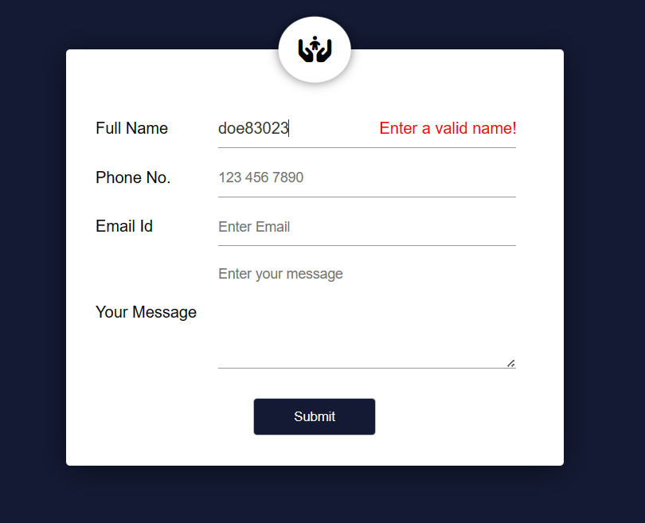

# Form validator with Regular Expression

## Landing page
* Name is validated on whether it contains only letters.

* Phone number is validated on whether it contains only numbers, it has 11 characters, starts with '01' and 3rd character is among [3-9].

* Email is validated on whether it ends with '@bup.edu.bd'.

* Success message is shown after form is submitted correctly.

## Result Page
* The resultant values are shown at process.php file

